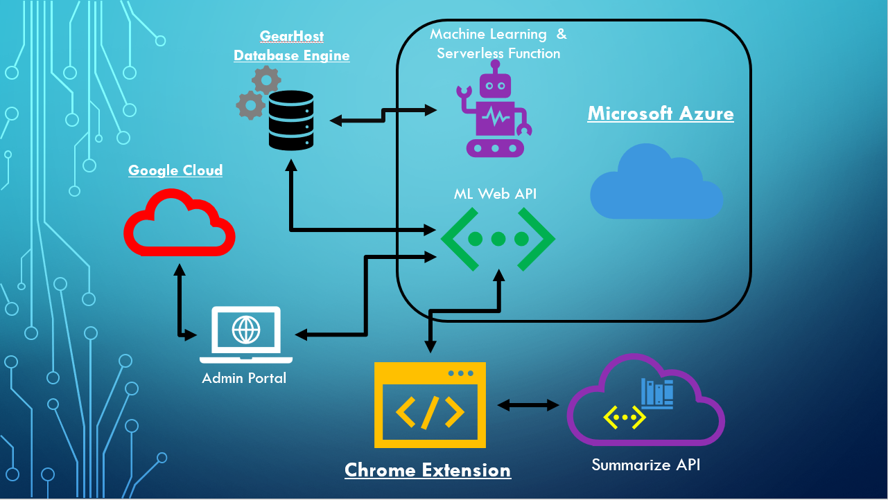

# BaitHate - Clickbait Identification
"You won't BELIEVE how great this extension is."

Let's be honest - we've all been there. You see that headline that you know you shouldn't click, but you just can't resist. You fell for clickbait.

Clickbait is a manipulative practice the litters the web and pollutes your browser with noise. 

We developed BaitHate to help identify clickbait at a glance and get back to cleaner browsing.

### Tech Specs
We decided to use our differences as our strengths using a variety of platforms and languages. C#, SQL, Python, and JavaScript were the primary languages for our solution. C# provided us with a powerful statically typed back end. It was used for our machine learning and API. We used JavaScript for the chrome extension to embed our results right in the user’s browser. Finally, we used a python module to generate short descriptions for some of the Clickbait articles. We used a plethora of services from Azure serverless functions to Google Cloud Platforms powerful app services. All of our data is securely stored in a SQL database kindly offered for free by GearHost. You can see a picture of our full cloud solution below.

## Installation Instructions

### Google Chrome

#### Manual
1. Download this repo as a [ZIP file from GitHub](https://github.com/xamroot/baithate/archive/master.zip).
2. Unzip the file and you should have a folder named `baithate`.
3. In Chrome go to the extensions page (`chrome://extensions`).
4. Enable Developer Mode.
5. Drag the 'baithate-master' folder anywhere on the page to import it (do not delete the folder afterwards).

#### Chrome Web Store
[Get BaitHate From the Chrome Web Store](https://chrome.google.com/webstore/detail/baithate/doalljdmbfpigicfalabpljamcdcadlg)

## Usage

Once installed, BaitHate will automatically display an estimated likelihood that a title link on a supported site is clickbait, as well as a helpful color indicator. 

To disable, click the BaitHate extension icon on the toolbar and toggle "enable BaitHate" to off and referesh the page.

####  Supported Sites

Currently, the extension needs to be configured for each individual site. It is our hope to develop a general form in the future. Below is a list of sites currently supported.

1. Google [Search](https://www.google.com) / [News](https://news.google.com)
1. [Youtube](https://www.youtube.com)
2. [Buzzfeed](https://www.buzzfeed.com)
3. [Hacker News](https://www.news.ycombinator.com)

